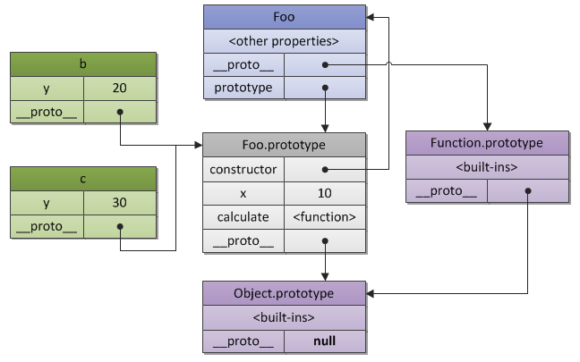

# Object-oriented Javascript
<!-- TOC -->

- [Object-oriented Javascript](#object-oriented-javascript)
  - [Inheritance](#inheritance)
    - [What is Inheritance](#what-is-inheritance)
    - [Inheritance in Javascript](#inheritance-in-javascript)
      - [Prototype-based Language](#prototype-based-language)
      - [Javascript Prototype Object](#javascript-prototype-object)
      - [Javascript prototype chain](#javascript-prototype-chain)
      - [Javascript Inheritance Implementation](#javascript-inheritance-implementation)
      - [Object.create](#objectcreate)
      - [Miscellaneous](#miscellaneous)

<!-- /TOC -->

<br/>
<br/>
Javascript is one Object-oriented programming(OOP) language. In Javascript, Object is building block of our program. 

## Inheritance
In JS, we will notice this phenomenon: when we define two objects, these objects will have some common methods.
Executing following code in browser console:
``` javascript
var a = {age: 23};
undefined
var b = {age: 24};
undefined
a.hasOwnProperty
function hasOwnProperty() { [native code] }
b.hasOwnProperty
function hasOwnProperty() { [native code] }
b.hasOwnProperty === b.hasOwnProperty
true
```
Now, we may have some questions:
1. Where those methods come from(we just define an 'age' property in object).
2. Why two different objects have the same methods.

Steps go on:
``` javascript
a.__proto__
Object {__defineGetter__: function, __defineSetter__: function, hasOwnProperty: function, __lookupGetter__: function, __lookupSetter__: function…}

b.__proto__
Object {__defineGetter__: function, __defineSetter__: function, hasOwnProperty: function, __lookupGetter__: function, __lookupSetter__: function…}

a.__proto__ === b.__proto__
true

a.__proto__ === Object.prototype
true
```
Proceding code may tell us some basic facts: when defining objects(or any other kinds of data), the variable will inherit some perperties and methods from constructor. It is called **Inheritance** in OOP.

### What is Inheritance
To explain inheritance in OOP, we are be able to get a formal definition from [wikipedia](https://en.wikipedia.org/wiki/Inheritance_(object-oriented_programming)):

>In object-oriented programming, inheritance is when an object or class is based on another object (prototypal inheritance) or class (class-based inheritance), using the same implementation (inheriting from an object or class: inheriting behavior, programming by difference) or specifying a new implementation to maintain the same behavior (realizing an interface). Such an inherited class is called a subclass of its parent class or super class. It is a mechanism for code reuse and to allow independent extensions of the original software via public classes and interfaces. The relationships of objects or classes through inheritance give rise to a hierarchy.

We can extract several key words from this definition: _based on, the same, difference._ 

We might explain inheritance in plain language and analogy: You inherit some characteristics from our parents( DNA, height, looks, etc.). Also, your brother or sister inherit some characteristics from your parents. You looks like your brother or sister since you both inherit from the same parents and you have the same or similar characteristics with you parents just because you inherit from them. On the other hand, you do not looks exact the same as your parent or brother, since you have your own personal difference.


### Inheritance in Javascript
#### Prototype-based Language
Javascript is often referred as a prototype-based language which is a kind of style in OOP. As the [following](https://en.wikipedia.org/wiki/Prototype-based_programming) state:
> Prototype-based programming is a style of object-oriented programming in which behaviour reuse (known as inheritance) is performed via a process of reusing existing objects via **delegation** that serve as **prototypes**. This model can also be known as prototypal, prototype-oriented, classless, or instance-based programming. Delegation is the language feature that supports prototype-based programming.

An [explaination](https://en.wikipedia.org/wiki/Delegation_(object-oriented_programming)) about delegation:
>In object-oriented programming, delegation refers to evaluating a member (property or method) of one object (the receiver) in the context of another, original object (the sender). Delegation can be done explicitly, by passing the sending object to the receiving object, which can be done in any object-oriented language; or implicitly, by the member lookup rules of the language, which requires language support for the feature. Implicit delegation is the fundamental method for behavior reuse in prototype-based programming, corresponding to inheritance in class-based programming.

Javascript implement both [explicitly and implicitly delegation](https://en.wikipedia.org/wiki/JavaScript#Delegative):
>**Functions as roles (Traits and Mixins)**
JavaScript natively supports various function-based implementations of Role patterns like Traits and Mixins. Such a function defines additional behavior by at least one method bound to the this keyword within its function body. A Role then has to be delegated explicitly via call or apply to objects that need to feature additional behavior that is not shared via the prototype chain.

>**Object composition and inheritance**
Whereas explicit function-based delegation does cover composition in JavaScript, implicit delegation already happens every time the prototype chain is walked in order to, e.g., find a method that might be related to but is not directly owned by an object. Once the method is found it gets called within this object's context. Thus inheritance in JavaScript is covered by a delegation automatism that is bound to the prototype property of constructor functions.

As above state, prototype plays an important role in javascript inheritance. Let's make clear about javascript prototype object.


#### Javascript Prototype Object
In Javascript, constructor function plays the role of 'class' in some other OOP language like Java.
``` javascript
function Person() {
  // it is a constructor function
}

// we create a new object via new command
var person1 = new Person();

// person1 constructor property points to Persion constructor function.
person1.constructor === Person;
true
```
Preceding codes demonstrate what the 'constructor' property mean in JS: object constructor property points to 'who constructed me', or saying, 'where I come from'.

Every function has a prototype property. The properties and methods defined on prototype object will be inherited by the object constructed by this constructor function.
``` javascript
Person.prototype.name = function(){
  console.log(this.name)
};

var person2 = new Person();

person2.name;
function (){
  console.log(this.name)
}

person2.name === Person.prototype.name;
true
person2.name === person2.constructor.prototype.name;
true
person2.name === person2.constructor.name;
false
```
As described above, constructor function prototype object acts as a 'template object', which the objects inherited from it would has its properties and methods. This feature is done by javascript inheritance mechanism implicitly and automatically.


#### Javascript prototype chain
The object created above not only can invoke the properties and methods of Person constructor, but also some other properties and methods, which defined in the constructor's prototype object of person2's constrcutor prototype object.
It may mouthful, let's see several examples
First of all, let's see what `__proto__` is
``` javascript
// __proto__ is a short cut which points to constructor's prototype object.
person2.constructor.prototype === Person.prototype;
true
```
[To be exactly](https://stackoverflow.com/questions/9959727/proto-vs-prototype-in-javascript),
> `__proto__` is the actual object that is used in the lookup chain to resolve methods, etc.

After revealed what `__proto__` is, we can explore the structure of prototype chain.
``` javascript
// layer 1. 
// person2 object itself:
person2.age = 12;
12
person2;
Person {age: 12}

// layer 2. 
// person2's constructor prototype. 
// person2 is able to get access to properties and method in this object.
person2.__proto__;
Object {name: function, constructor: function}

// So now, let's think about, where the properties and methods in Person's prototype come from?
// They come from itself and it's constructor's prototype.
// It is layer 3.
person2.__proto__.__proto__;
Object {__defineGetter__: function, __defineSetter__: function, hasOwnProperty: function, __lookupGetter__: function, __lookupSetter__: function…}

// the same logic above, let's see layer 4.
// It is null.
person2.__proto__.__proto__.__proto__;
null
``` 
We have seen the prototype chain logic above. `person2` is able to get access all the properties and methods defined on its chain.

Also, we notice the endpoint of prototype chain is `null`. `null` is the endpoint of all javascript variables except `null` and `undefined`.
``` javascript
// string
var s = 'it is a string';
undefined

s.__proto__;
String {length: 0, constructor: function, charAt: function, charCodeAt: function, concat: function…}

s.__proto__.__proto__;
Object {__defineGetter__: function, __defineSetter__: function, hasOwnProperty: function, __lookupGetter__: function, __lookupSetter__: function…}constructor: function Object()hasOwnProperty: function hasOwnProperty()isPrototypeOf: function isPrototypeOf()propertyIsEnumerable: function propertyIsEnumerable()toLocaleString: function toLocaleString()toString: function toString()valueOf: function valueOf()__defineGetter__: function __defineGetter__()__defineSetter__: function __defineSetter__()__lookupGetter__: function __lookupGetter__()__lookupSetter__: function __lookupSetter__()get __proto__: function __proto__()set __proto__: function __proto__()

s.__proto__.__proto__.__proto__;
null

// number
var n = 12;
undefined

n.__proto__;
Number {constructor: function, toExponential: function, toFixed: function, toPrecision: function, toString: function…}

n.__proto__.__proto__;
Object {__defineGetter__: function, __defineSetter__: function, hasOwnProperty: function, __lookupGetter__: function, __lookupSetter__: function…}

n.__proto__.__proto__.__proto__;
null

// Boolean
var t = true;
undefined

t.__proto__;
Boolean {[[PrimitiveValue]]: false, constructor: function, toString: function, valueOf: function}

t.__proto__.__proto__;
Object {__defineGetter__: function, __defineSetter__: function, hasOwnProperty: function, __lookupGetter__: function, __lookupSetter__: function…}

t.__proto__.__proto__.__proto__;
null

// the second last layer of prototype chain of above variables all points to the same prototype object
s.__proto__.__proto__ === n.__proto__.__proto__;
true

s.__proto__.__proto__ === t.__proto__.__proto__;
true
```

Object can get access to properties and methods of constructor's prototype, however, it does not means that child object owned these properties and methods. They just get access to them(linked via prototype chain), properties and methods will not be coyied or passed to them.

Furthermore, when we modify the properties or methods defined on the prototype chain, the modification will be avaliable to all the object instances created from this constructor. 

#### Javascript Inheritance Implementation
Following code will demonstrate how to define a new constructor function, Person, which has some common properties and methods to be inherited, and based on this Person constructor, we extend a constructors which have individual properties and methods.
``` javascript
// We define all properties in constructor itself. This make extending new constructor based on it easier.
function Person(name, age, gender){
	this.name = name;
	this.age = age;
	this.gender = gender;
}
// We define all methods in constructor's prototype object.
Person.prototype.greeting = function() {
  console.log('Hi ' + this.name);
};

// Utill now, we can create a new instance object inherit from Person.
var person1 = new Person('John', '23', 'male');

person1;
Person {name: "John", age: "23", gender: "male"}

person1.greeting();
Hi John

// Notice, since we define properties on constructor itself with this key words, new created instance object will owne name, age and gender properties.
```
Well, now, we would like to create a new constructor called Student, which has similar properties and methods with Person.
We may create this new constructor from zero, however, since we would like to follow the rule of code reuse, try to extending based on Person is a better way.
``` javascript
// The first parameter in call method set the which object 'this' keyword in Person function points to.
function Student(name, age, gender, school) {
	Person.call(this, name, age, gender);
	this.school = school;
}

// At this point, we create a new object inherit from Student constructor
var student1 = new Student('Bo', '25', 'male', 'Random School');

student1
Student {name: "Bo", age: "25", gender: "male", school: "Random School"}
```

But we have a problem now
``` javascript
student1.name;
"Bo"

student1.greeting;
undefined
```
It is clear that student1 can not access to greeting method, since Student constructor do not inherit its prototype from Person prototype.

``` javascript
// Define Student prototype, which inherit all method from Person.prototype.
Student.prototype = Object.create(Person.prototype);

// We can define new method in Student prototype object.
Student.prototype.classmates = function() {
  console.log(this.name + ' has ' + Math.floor(Math.random()*100) + ' classmates');
}

// Now we can see:
Student.prototype;
Person {}__proto__: Objectgreeting: function ()constructor: function Person(name, age, gender)__proto__: Object

Student.prototype.greeting;
function () {
  console.log('Hi ' + this.name);
}

// Create a new object again
var student2 = new Student('Jo', '20', 'male', 'Any School');

// We can get access greeting method now
student2.greeting();
Hi Jo

// classmates method
student2.classmates();
Jo has 87 classmates
```
Now, close to task done, but we still have the last problem to solve.
We find that `student2.constructor` points to `Person` which is not correspond to what we expect. We expect `student2.constructor` should points to `Student`. The reason of the problem is we do not specify `constructor` property in `Student.prototype`;
``` javascript
// Sloution of this problem is explictly defining constructor property in Student.prototye.
Student.prototype.constructor = Student;

// Now, everything is ok
student2.constructor === Student;
true
```

#### Object.create
`Object.create` example:
``` javascript
var a = {age: 24};
var b = Object.create(a);

b.__proto__ === a;
==> true
```

As we can see, we create `b` based on `a`, and `b.__proto__` points to `a`. That's to say, we treat `a` as a contructor function's prototype.
The `Object.create` method similar with the following process.
``` javascript
var a = {age: 24};

function F(){};
F.prototype = a;

var b = new F();
b.age;
==> 24
b.__proto__ === a;
==> true
```
Furthermore, `Object.create` method can define properties on created owned object.
``` javascript
// a simple example
var a = {age: 24};
var b = Object.create(a, {name: {value: 'Irving'}});

b;
==> Object {name: "Irving"}
```

#### Miscellaneous
Here are some miscellaneous points about javascript inheritance.
1. We define a function in javascript, as we already know, this function has a prototype object. What's more, this prototype has constructor property, this property points to this function itself.
``` javascript
function f(){};

f.prototype
==> Object {constructor: function}
      constructor:function f()
      __proto__:Object

f.prototype.constructor === f;
==> true
```

2. As mentioned above, if we looking up variable's ( except `null` and `undefined` ) prototype chain via `__proto__`, We will encounter with a common object, that is `Object.prototype`.
``` javascript
// object
var a = {};

a.__proto__
==> Object {__defineGetter__: function, __defineSetter__: function, hasOwnProperty: function, __lookupGetter__: function, __lookupSetter__: function…}

a.__proto__ === Object.prototype;
==> true

// string
var s = 'it is a string';

s.__proto__.__proto__ === Object.prototype;
==> true
```
That is to say, `Object` is a constructor function and all javascript variables inheritance methods from `Object`.

Beside the methods defined in `Object.prototype`, we can also use some methods like:
``` javascript
Object.create();
Object.keys();
Object.entries();
```
These methods are defined in `Object` constructor function itself and them will not be inherited.

We can use these method like follows:
``` javascript
var arr = ['bo', 'jo', 'john'];
Object.keys.call(null, arr);
==> (3) ["0", "1", "2"]
```
Similarly, javascript provides some ready to use constructor function.
``` javascript
var s = 'it is a string';
s.__proto__ === String.prototype;
==> true
```

3.
Using a [diagram](http://dmitrysoshnikov.com/ecmascript/javascript-the-core/) to make `prototype`, `__proto__` and `constructor` concepts more clear.
``` javascript
// code from http://dmitrysoshnikov.com/ecmascript/javascript-the-core/
function Foo(y) {
  this.y = y;
}
Foo.prototype.x = 10;
Foo.prototype.calculate = function (z) {
  return this.x + this.y + z;
};

var b = new Foo(20);
var c = new Foo(30);
```
<br/>




<br/>
<br/>
<br/>
<br/>
References:<br/>
[1] https://en.wikipedia.org/wiki/Inheritance_(object-oriented_programming)<br/>
[2] https://en.wikipedia.org/wiki/Prototype-based_programming<br/>
[3] https://en.wikipedia.org/wiki/Delegation_(object-oriented_programming)<br/>
[4] https://en.wikipedia.org/wiki/JavaScript#Delegative<br/>
[5] https://stackoverflow.com/questions/9959727/proto-vs-prototype-in-javascript<br/>
[6] http://dmitrysoshnikov.com/ecmascript/javascript-the-core/<br/>
<br/>

Further Reading:<br/>
[1] https://developer.mozilla.org/en-US/docs/Learn/JavaScript/Objects/Object-oriented_JS#Object-oriented_programming_from_10000_meters<br/>
[2] https://developer.mozilla.org/en-US/docs/Learn/JavaScript/Objects/Object_prototypes<br/>
[3] https://developer.mozilla.org/en-US/docs/Learn/JavaScript/Objects/Inheritance<br/>
[4] http://www.datchley.name/understanding-prototypes-delegation-composition/<br/>
[5] http://javascriptissexy.com/oop-in-javascript-what-you-need-to-know/<br/>
[6] http://javascriptissexy.com/javascript-prototype-in-plain-detailed-language/


