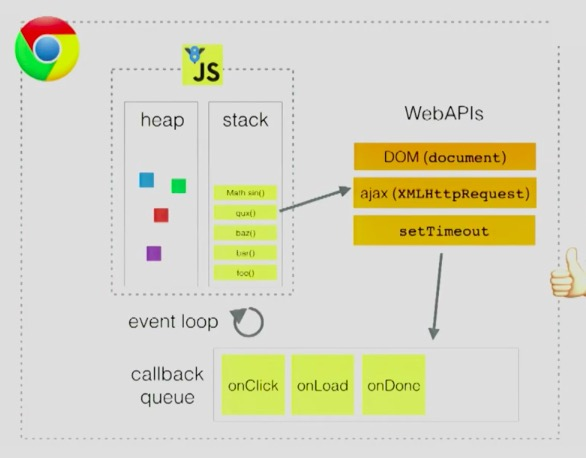

# call stack

## Resources
video: 
  The Call Stack https://www.youtube.com/watch?v=Q2sFmqvpBe0

Site:
  Visualizing the javascript runtime at runtime  http://latentflip.com/loupe

  

## how js works
video: Help, I’m stuck in an event-loop.

https://vimeo.com/96425312

one thread == one call stack == one thing at a time

## about stack over flow error

http://2ality.com/2014/04/call-stack-size.html

> Mr. Aleph pointed out to me that on V8, the number of recursive calls you can make depends on two quantities: **the size of the stack and the size of the stack frame** (holding parameters and local variables). 